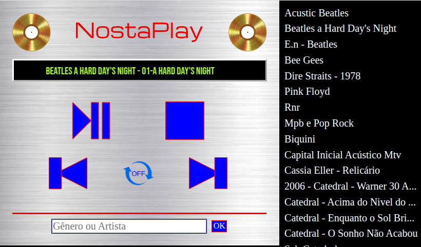
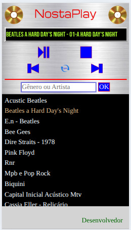

# 🎧 Audio Player - Projeto Nostaplay

Um player de áudio desenvolvido com tecnologias puras: **PHP**, **HTML**, **CSS** e **JavaScript**, sem o uso de frameworks ou bibliotecas externas.

## 📦 Funcionalidades

- Interface intuitiva e responsiva para reprodução de músicas
- API em PHP para listagem automática dos diretórios e arquivos de áudio
- Controles de reprodução: play, pause, próxima, anterior
- Exibição do tempo atual e duração da faixa
- Feedback visual durante a reprodução
- Compatível com arquivos `.mp3`

## 🛠 Tecnologias Usadas

- `PHP` – Para criação da API que acessa diretórios de áudio
- `HTML` – Estrutura semântica da interface do player
- `CSS` – Estilização visual com responsividade
- `JavaScript` – Controle de reprodução, carregamento das faixas e interação com o usuário

## Screenshots

Feito com café ☕, dedicação e um toque de nostalgia 🎶

## Contact

Developed by [Sulivando Lima / Antonio Lima]. Feel free to connect\!

  * Sulivando: [https://sulivando.com.br](https://sulivando.com.br)

-----

